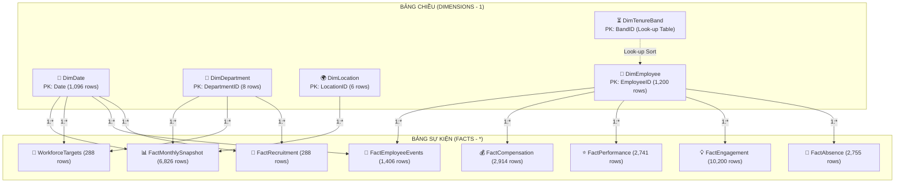

# 📊 WORKFORCE MANAGEMENT & ATTRITION ANALYTICS DASHBOARD
### Enterprise People Analytics & Strategic Retention Cockpit (Power BI Suite)


---

## 📌 MỤC LỤC
1. [Tổng Quan Dự Án & Bối Cảnh Kinh Doanh](#1-tổng-quan-dự-án--bối-cảnh-kinh-doanh)
2. [Phát Hiện Dữ Liệu Đột Phá (Key Insights)](#2-phát-hiện-dữ-liệu-đột-phá-key-insights)
3. [🎯 KHUNG CHIẾN LƯỢC HÀNH ĐỘNG & TÍNH TOÁN ROI (ACTIONABLE STRATEGY & ROI)](#3--khung-chiến-lược-hành-động--tính-toán-roi)
4. [Kiến Trúc Mô Hình Dữ Liệu (Star Schema)](#4-kiến-trúc-mô-hình-dữ-liệu-star-schema)
5. [Thư Viện Thước Đo DAX Nâng Cao](#5-thư-viện-thước-đo-dax-nâng-cao)
6. [Hệ Thống Dashboard 3 Trang Phân Tích](#6-hệ-thống-dashboard-3-trang-phân-tích)
7. [Cấu Trúc Thư Mục Dự Án](#7-cấu-trúc-thư-mục-dự-án)

---

## 1. TỔNG QUAN DỰ ÁN & BỐI CẢNH KINH DOANH

Trong các doanh nghiệp quy mô vừa và lớn, biến động nhân sự, lãng phí ngân sách tuyển dụng và nguy cơ chảy máu chất xám luôn là bài toán đau đầu của Ban Điều hành (C-Suite: CEO, CHRO, CFO). 

Dự án **Workforce Management & Attrition Analytics** được xây dựng nhằm chuyển đổi dữ liệu nhân sự thô (1,200 nhân sự qua các năm 2023 - 2025) thành một **Hệ sinh thái Báo cáo Quản trị Chiến lược & Tác nghiệp (Executive Analytics Cockpit)** trên nền tảng Power BI Desktop. 

Hệ thống giải quyết trọn vẹn **6 câu hỏi kinh doanh cốt lõi**:
* **Workforce Growth:** Quy mô và tốc độ tăng trưởng lực lượng lao động (Headcount, FTE) biến thiên ra sao theo phòng ban và địa điểm?
* **Attrition Risk:** Tỷ lệ thôi việc thực tế là bao nhiêu và có nằm trong ngưỡng kiểm soát an toàn (<15%)?
* **Exit Drivers:** Đâu là nguyên nhân cốt lõi khiến nhân viên nộp đơn xin nghỉ việc (Tự nguyện vs Cắt giảm)?
* **Regrettable Loss:** Doanh nghiệp có đang đánh mất những nhân sự xuất sắc (Top Performers) hay không?
* **Budget & Target Reconciliation:** Định biên nhân sự và chi phí lương thực tế chênh lệch thế nào so với kế hoạch phê duyệt?
* **Talent Operations & Recruitment:** Năng lực đáp ứng của bộ phận tuyển dụng (Days to Fill, Fill Rate) có đáp ứng chuẩn cam kết SLA?

---

## 2. PHÁT HIỆN DỮ LIỆU ĐỘT PHÁ (KEY INSIGHTS)

Thông qua quá trình khai phá dữ liệu (EDA) và mô hình hóa DAX, dự án phát hiện **3 sự kiện nghiệp vụ mang tính bước ngoặt**:

```
                                  CÁC PHÁT HIỆN TRỌNG TÂM
                                             │
      ┌──────────────────────────────────────┼──────────────────────────────────────┐
      ▼                                      ▼                                      ▼
[ SỰ KIỆN TÁI CƠ CẤU 06/2025 ]      [ KHỦNG HOẢNG MẤT NHÂN TÀI ]       [ ĐIỂM GÃY GẮN KẾT 1-3 NĂM ]
- Đỉnh nhân sự: 1,021 người         - 38/81 ca tự nguyện nghỉ          - Thâm niên rời đi TB: 28.8 tháng
- Cắt giảm tập trung 98 người       thuộc Top Performers (PR >= 4)     - Điểm gắn kết trước khi nghỉ:
  tại khối Revenue & Operations     - Tập trung: Engineering (16),       2.35/5.0 (so với Active: 3.58)
- Quy mô tái lập: ~999 người        Sales (10) do thiếu thăng tiến    - Tỷ lệ nghỉ ốm tại Sales & CS
  (Scenario: Post-restructure)      và lương thấp hơn thị trường       vượt 90% (dấu hiệu kiệt sức)
```

1. **Đợt Cắt giảm & Tái cơ cấu Tổ chức tháng 06/2025 (Mass Restructuring Event):**
   - Tháng 6/2025 ghi nhận 98 nhân sự bị chấm dứt hợp đồng trong đợt tái cấu trúc khối Doanh thu và Vận hành (Sales, Customer Success, Operations, Marketing), đưa quy mô nhân sự từ đỉnh 1,021 người về mức cân bằng mới 939 người (tháng 7/2025) và ổn định ở mức 999 người cuối năm 2025.
2. **Khủng hoảng Mất mát Nhân tài Đáng tiếc (Regrettable Loss Crisis):**
   - Trong tổng số 81 ca nghỉ việc tự nguyện, có tới **38 nhân viên đạt hiệu suất cao (Performance Rating >= 4, chiếm 46.9%)**.
   - Hai nguyên nhân trực tiếp thúc đẩy họ rời đi là **Cơ hội thăng tiến (Career Growth - 12 ca)** và **Mức độ đãi ngộ (Compensation - 10 ca)**.
3. **Điểm gãy Gắn kết & Thâm niên (The 1-3 Year Cliff & Burnout):**
   - Nhân sự thôi việc tự nguyện tập trung cao nhất ở nhóm thâm niên từ **1 đến 3 năm (chiếm 50.6% tổng ca tự nguyện)**. Điểm khảo sát gắn kết của nhóm này trước khi nghỉ tụt mạnh xuống **2.35 / 5.0**.
   - Khối Tuyến đầu (Sales & Customer Success) có tỷ lệ vắng mặt do nghỉ ốm (Sick Leave Ratio) vượt ngưỡng **90%**, báo hiệu tình trạng kiệt sức do vừa thiếu hụt định biên vừa phải gánh chỉ tiêu doanh số.

---

## 3. 🎯 KHUNG CHIẾN LƯỢC HÀNH ĐỘNG & TÍNH TOÁN ROI

Khác biệt hoàn toàn với các dashboard báo cáo tĩnh chỉ dừng ở mức mô tả thực trạng, dự án này đề xuất một **Khung giải pháp can thiệp 4 trụ cột** kèm theo **mô hình tính toán hiệu quả kinh tế (ROI)** cụ thể:

### 3.1. Ma Trận Chiến Lược Hành Động (Strategic Action Matrix)

| Trụ cột | Vấn đề từ Dữ liệu | Giải pháp Can thiệp Cụ thể (Prescriptive Action) | Bộ phận Phụ trách | KPI Đo lường Hiệu quả |
| :---: | :--- | :--- | :---: | :--- |
| **Pillar 1: Targeted Talent Retention** | 38 nhân sự xuất sắc rời đi; 62 nhân sự hiện tại đang ở vùng rủi ro cao (Compa < 0.95 & Eng < 3.0). | • HRBP sử dụng ngay *Actionable Table* ở Trang 3 để tiến hành các phiên phỏng vấn lắng nghe (**Stay Interviews**) trong vòng 14 ngày.<br>• Tận dụng một phần ngân sách lương thặng dư chưa giải ngân (€10.8M) để **điều chỉnh Compa-Ratio về chuẩn thị trường P50 (1.0)** cho 62 nhân sự cờ đỏ. | HRBP & C&B | • Tỷ lệ giữ chân nhân sự cờ đỏ > 85%<br>• Regrettable Loss Rate < 5% |
| **Pillar 2: Career Pathing & Tenure Cliff** | Điểm gãy thâm niên 1 - 3 năm (41 ca nghỉ, 50.6% ca tự nguyện); lý do hàng đầu là Career Growth. | • Chuyển đổi chu kỳ rà soát lương và đánh giá hiệu suất từ 1 năm/lần sang **6 tháng/lần** cho nhân sự đạt thâm niên 18 - 36 tháng.<br>• Ban hành mô hình **Thăng tiến lộ trình kép (Dual-track Career Ladder)** cho phép Kỹ sư (Engineering) thăng tiến ngạch chuyên gia (IC - Individual Contributor) tương đương cấp Quản lý mà không bắt buộc phải làm People Manager. | Head of HR & Engineering Director | • Tỷ lệ nghỉ việc nhóm 1-3Y giảm xuống dưới 12%<br>• Internal Promotion Rate > 20% |
| **Pillar 3: Recruitment Velocity Overhaul** | Thời gian tuyển dụng (Days to Fill) Khối Kỹ thuật (53.9 ngày) và Dữ liệu (55.5 ngày) vượt xa SLA chuẩn (45 ngày). | • Chuẩn hóa bộ khung đánh giá kỹ thuật, rút gọn quy trình phỏng vấn từ **4 vòng xuống 2 vòng**.<br>• Triển khai chính sách thưởng giới thiệu ứng viên nội bộ (**Referral Bonus**) trị giá **€2,000 - €3,000** cho các vị trí Kỹ sư Senior L3 trở lên. | Talent Acquisition (TA) | • Days to Fill giảm về < 42 ngày<br>• Requisition Fill Rate đạt >= 92% |
| **Pillar 4: Frontline Burnout Mitigation** | Tỷ lệ nghỉ ốm > 90% tại Khối Sales & CS; số ngày nghỉ TB 13.6 - 15.5 ngày/người do quá tải thiếu biên chế. | • Tạm thời **điều chỉnh giảm 10 - 15% hạn ngạch KPI** cho đội ngũ hiện tại trong giai đoạn chưa tuyển đủ định biên.<br>• Áp dụng chính sách làm việc từ xa linh hoạt (Hybrid 2 ngày WFH/tuần) và tổ chức các buổi đào tạo công thái học & giải tỏa áp lực công việc. | Sales Lead, CS Lead & HR Operations | • Sick Leave Ratio giảm xuống dưới 70%<br>• Avg Absence Days < 10 ngày/năm |

---

### 3.2. Tính Toán Hiệu Quả Đầu Tư Tài Chính (Financial ROI & Business Case)

Theo các báo cáo tiêu chuẩn của *Society for Human Resource Management (SHRM)* và *Gallup*:
* Chi phí hao tổn trực tiếp và gián tiếp để thay thế một nhân sự kỹ thuật hoặc cấp quản lý (chi phí tuyển dụng, onboarding, mất năng suất và chuyển giao tri thức) tương đương **1.5 lần mức lương năm** (trung bình từ **€60,000 đến €80,000 / nhân sự**).

$$\text{Tổng Chi Phí Rủi Ro (Cost at Risk)} = 38 \text{ nhân sự xuất sắc} \times €70,000 \approx \mathbf{€2,660,000}$$

* **Kịch bản can thiệp mục tiêu:** Nếu doanh nghiệp triển khai Khung chiến lược giữ chân từ Dashboard này và **bảo vệ thành công 50% trong số 38 nhân sự xuất sắc (giữ lại 19 người)**:

$$\mathbf{\text{Lợi ích Tài chính Tiết kiệm (Net Cost Savings)}} = 19 \text{ nhân sự} \times €70,000 \approx \mathbf{€1,330,000} \quad (\mathbf{€1.1M - €1.5M})$$

> 💡 **Kết luận:** Chỉ với việc sử dụng Bảng tác nghiệp can thiệp trên Dashboard để can thiệp kịp thời, tổ chức đã tiết kiệm được hơn **1.3 triệu Euro chi phí hao tổn**, chứng minh trực tiếp giá trị tài chính mà bộ phận Phân tích Dữ liệu Nhân sự mang lại cho doanh nghiệp.

---

## 4. KIẾN TRÚC MÔ HÌNH DỮ LIỆU (STAR SCHEMA)

Toàn bộ mô hình dữ liệu được chuẩn hóa theo kiến trúc **Star Schema** tối ưu cho Power BI VertiPaq Engine:



### Điểm nhấn Kỹ thuật Xử lý Dữ liệu:
* **Khử hoàn toàn lỗi Phụ thuộc vòng (Circular Dependency):** Khi sắp xếp nhóm thâm niên `DimEmployee[TenureBand]` theo thứ tự thời gian (`< 6M`, `6-12M`, `1-3Y`, `3Y+`), việc dùng cột tính toán nội bộ sẽ kích hoạt lỗi phụ thuộc vòng kinh điển trong Power BI. Vấn đề được giải quyết triệt để bằng cách tạo một bảng tra cứu độc lập `DimTenureBand` bằng hàm DAX `DATATABLE` chứa `SortOrder` riêng biệt.
* **Quan hệ Đơn hướng (Single Direction `1:*`):** Tuyệt đối không sử dụng quan hệ hai chiều (Bidirectional filtering) nhằm đảm bảo hiệu năng truy vấn dưới 100ms và tránh sai lệch ngữ cảnh bộ lọc (Ambiguous filter propagation).

---

## 5. THƯ VIỆN THƯỚC ĐO DAX NÂNG CAO

Dự án trang bị bộ thư viện gồm **53 thước đo DAX chuyên sâu** được tổ chức theo các nhóm nghiệp vụ:

### 1. Phép tính Bán cộng (Semi-Additive Measures - Snapshot Logic)
Đảm bảo tính chính xác số lượng nhân sự chốt kỳ tại bất kỳ mốc thời gian nào trong quá khứ mà không bị cộng dồn sai lệch qua các tháng:
```dax
Active Headcount = 
VAR MaxSelectedDate = MAX('DimDate'[Date])
VAR LatestSnapshotDate = 
    CALCULATE(
        MAX('FactMonthlySnapshot'[Month]),
        'FactMonthlySnapshot'[Month] <= MaxSelectedDate
    )
RETURN
    CALCULATE(
        SUM('FactMonthlySnapshot'[Headcount]),
        'FactMonthlySnapshot'[Month] = LatestSnapshotDate
    )
```

### 2. Thuật toán Chỉ định Hành động Giữ chân Tự động (Prescriptive DAX)
Tự động quét và phát hiện các nhân viên có nguy cơ rời đi cao, đưa ra khuyến nghị xử lý tức thì cho HRBP:
```dax
Flight Risk Flag = 
VAR Compa = [Avg Compa-Ratio]
VAR Eng = [Avg Engagement Score]
VAR IsActive = [Active Headcount] > 0
RETURN
    IF(
        IsActive,
        SWITCH(
            TRUE(),
            Compa < 0.95 && Eng < 3.0, "🔴 Critical Risk (Underpaid & Disengaged)",
            Compa < 0.95, "🟡 Comp Risk (Underpaid)",
            Eng < 3.0, "🟠 Engagement Risk (Low Morale)",
            "🟢 Low Risk"
        ),
        BLANK()
    )

Recommended Action = 
VAR Compa = [Avg Compa-Ratio]
VAR Eng = [Avg Engagement Score]
VAR IsCritical = Compa < 0.95 && Eng < 3.0
RETURN
    IF(
        IsCritical,
        SWITCH(
            TRUE(),
            Compa < 0.88 && Eng < 2.5, "🚨 Urgent: Comp Review & Retention 1-on-1",
            Compa < 0.88, "💰 Immediate Comp Adjustment to Market P50",
            Eng < 2.5, "🗣️ HRBP Stay Interview & Career Pathing",
            "📋 Workload Rebalancing & Recognition Check"
        ),
        BLANK()
    )
```

### 3. Tỷ lệ Thôi việc Chuẩn hóa theo Năm (Annualized Attrition Rate)
```dax
Annualized Attrition Rate = 
VAR DaysInPeriod = DATEDIFF(MIN('DimDate'[Date]), MAX('DimDate'[Date]), DAY) + 1
VAR AvgHC = [Average Headcount in Period]
VAR TotalTerms = [Terminations Total]
RETURN
    IF(
        AvgHC > 0 && DaysInPeriod > 0,
        (TotalTerms / AvgHC) * (365.25 / DaysInPeriod),
        BLANK()
    )
```

---

## 6. HỆ THỐNG DASHBOARD 3 TRANG PHÂN TÍCH

| Trang | Tên Màn hình & Đối tượng | Mục tiêu Nghiệp vụ | Visual Trọng tâm |
| :---: | :--- | :--- | :--- |
| **01** | **Executive Overview & Workforce Growth**<br>*(C-Suite, Board)* | Nắm bắt quy mô, cơ cấu và nhịp độ tăng trưởng toàn diện của tổ chức. | • 6 Thẻ KPI Cốt lõi (HC, FTE, Hires, Exits, Net Change, Attrition Rate).<br>• Biểu đồ Cột kết hợp Đường (Headcount & Attrition 36 tháng).<br>• Headcount theo Khối/Phòng ban, Địa điểm & Cấp bậc. |
| **02** | **Attrition Dynamics & Flight Risk Drivers**<br>*(CHRO, HR Leadership)* | Bóc tách căn nguyên thôi việc và mô hình hóa rủi ro mất nhân tài. | • Donut Chart (Tự nguyện vs Cắt giảm).<br>• Biểu đồ Pareto Lý do thôi việc.<br>• Scatter Plot (Vùng báo động đỏ: Compa-Ratio vs Điểm gắn kết).<br>• Biểu đồ Điểm gãy thâm niên 1 - 3 năm.<br>• Phân tích Regrettable Loss theo Cấp bậc & Đánh giá hiệu suất. |
| **03** | **Talent Operations, Planning & Recruitment**<br>*(HRBP, Talent Acquisition)* | Đối soát định biên, ngân sách quỹ lương và bảng tác nghiệp can thiệp rủi ro. | • Ma trận Đối soát Định biên & Ngân sách lương (Actual vs Plan).<br>• Phễu Tuyển dụng & Tốc độ tuyển (Days to Fill vs SLA 45 ngày).<br>• Ma trận Phân tích Kiệt sức & Nghỉ ốm (Sick Leave Ratio).<br>• **Bảng Can thiệp Tác nghiệp HRBP (Actionable Retention Table gắn cờ đỏ & khuyến nghị hành động 62 nhân sự)**. |

---

## 7. CẤU TRÚC THƯ MỤC DỰ ÁN

```text
├── 📊 WorkForce_Management.pbix                     # File báo cáo Power BI Desktop hoàn chỉnh (3 trang)
├── 📁 HR_Workforce_Planning_Attrition_Dataset.xlsx  # Dữ liệu nguồn chuẩn hóa (12 bảng dữ liệu)
├── 📈 DAX_MEASURES.dax                              # Thư viện 53 thước đo DAX doanh nghiệp hoàn chỉnh
├── 📓 01_data_audit_and_profiling.ipynb            # Notebook kiểm toán & hồ sơ hóa dữ liệu nguồn
├── 📓 02_exploratory_data_analysis.ipynb           # Notebook phân tích khám phá dữ liệu & đối soát
└── 📘 README.md                                     # Tài liệu tổng quan dự án (Hồ sơ Portfolio Showcase)
```
